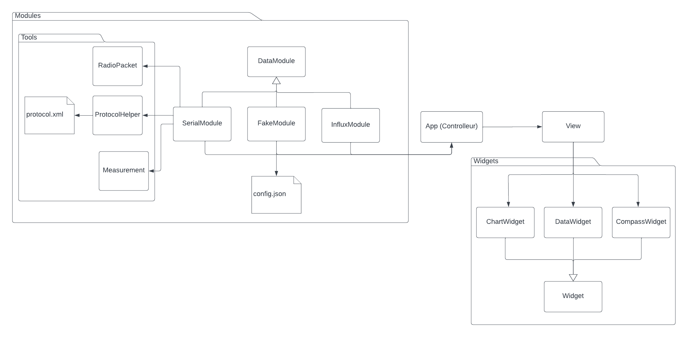

# CutePy

CutePy is RockÉTS ground station application. This project was made for having a more sustainable,
maintainable and simple ground station. It is strongly based on the previous work of David Bourgault,
CuteStation and Rocketsd. The main differences are that CutePy sticks to the essentials only :
**Recieving data and showing it on the application**. This of course does not mean that it is less practical
or have fewer functionalities than the original systems.

The system is built around the necessary only, with the goal of having the smallest amount of dependencies.

It is a Qt based ground control system.

## Architecture

CutePy is constructed around a MVC (Model, View, Controller) architecture. This ensures great communication between all sub-systems and is in itself a very modular design pattern.

#### App

The App(controller) deals with the creation of the modules (models) and the view. It ensures communication between them.

#### Modules

The modules are the subsytems in charge of the data. They are running on different threads and their purpose is to get and send the data from the rocket (or fake data) to the app or to a database.

#### View

The view is the Qt GUI. It's running on the main thread, and recieves the necessary data from the app. It is based on configurable widgets that can be placed in certain configurations.

## Dependencies

- Pyserial (For serial communication - essential to recieve data from the rocket)
- PySide6 (Qt framework for python)

## TODO list

- Adding option to chose config files and COM port
- Connection to a database (InfluxDB for now) and sending recieved serial data
- Adapting serialModule (and protocolHelper) to send data to rocket
- Create Installer and .py to .exe system
